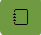

### Steps to get started:
1. Complete User Profile using [Profile link](https://kravvya.github.io/GardenLog.V2023/user)
2. Set up at least one Garden using [My Gardens link](https://kravvya.github.io/GardenLog.V2023/gardens)
3. (Optional) Use Garden Layout  to set up garden beds.
4. Review Plants catalog to ensure desired plant varieties are aviable. 
5. Use [Contact Us link](https://kravvya.github.io/GardenLog.V2023/contact) to request specific varieties to be added. Provide as much inforamtion as you can to expedite the process.
6. Use [Garden Plan link](https://kravvya.github.io/GardenLog.V2023/garden_plan) to set up new Garden Plant for the season.
7. Once Garden Plan is created, click on the name of the garden plan to go to the plant selection screen to pick plant varieties for the growing season. Use  button to add desired plant varieties.
8. After Plant Garden Is created, you can also use  button to add plant variety to the garden plan directly from the plant variety catalog.
9. (Optional) Use Garden Plant Layout  button to plan how to arrage selected plants in the garden beds.
10. Once Garde Planning steps are completed, review the schedule using [Calendar link](https://kravvya.github.io/GardenLog.V2023/schedule). Use  buttons to switch between graphical and table views.
11. Use [Tasks link](https://kravvya.github.io/GardenLog.V2023/tasks) to review upcomming tasks. Same screen can be used to add new custom tasks or to resolve existing tasks.
12. Use Work Log  from either Garden Layour screen or next to specific plant int he garden to review all the work that has been completed to date or to add a new work log. 